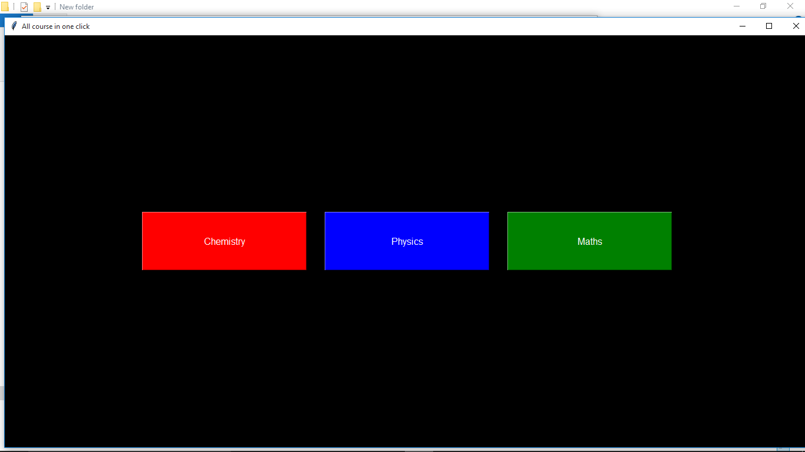
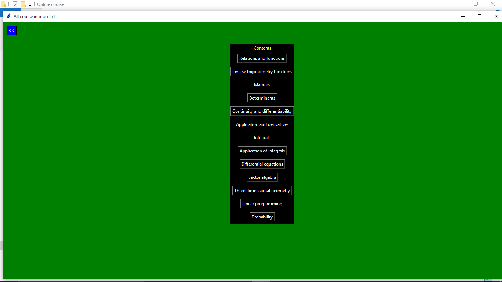
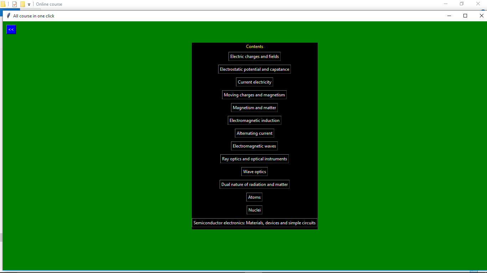
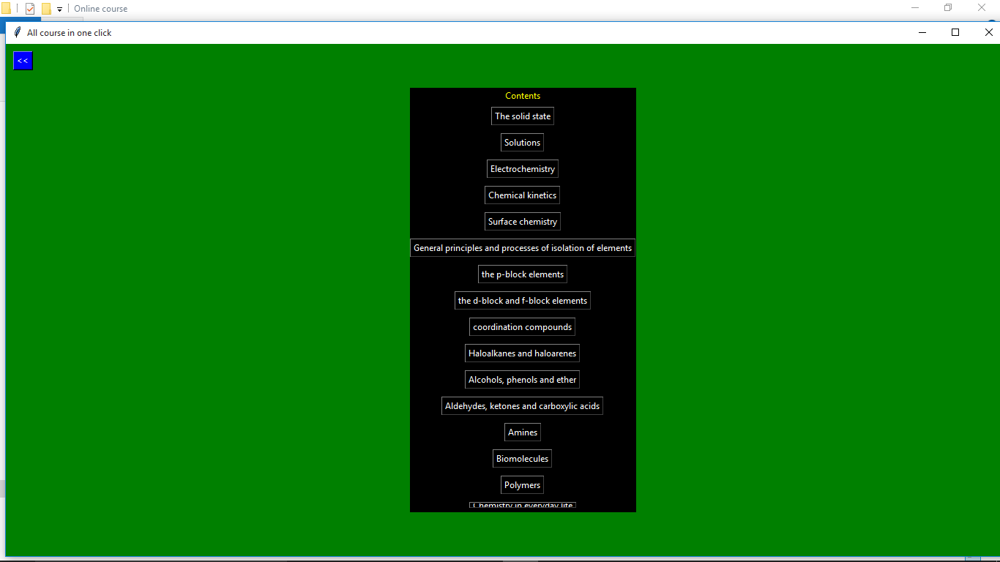

# Youtube Online courses in one click

For now it shows links of only three subjects of class 12.

It can be used as a shortcut while studying(cbse/jee/neet).

It redirects you to the different playlist and videos of different youtube channels such as:

* [Physics Walla - Alakh Pandey](https://www.youtube.com/channel/UCiGyWN6DEbnj2alu7iapuKQ)
* [Unacademy JEE](https://www.youtube.com/user/canvasclasses)
* [Vedantu JEE](https://www.youtube.com/user/VedantuInnovations)
* Physics Galaxy- [Youtube Channel](https://www.youtube.com/c/physicsgalaxy74) [Website](https://www.physicsgalaxy.com/home)

#### Maths chapter:

#### Physics chapter:

#### Chemistry chapter:

